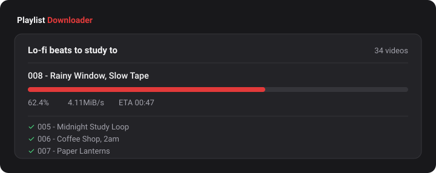

# YouTube Playlist Downloader

Download a whole YouTube playlist as MP4 video, or as MP3s with cover art.
One file to double-click, nothing to install. Windows 10 and 11.

About page: **https://playlist-downloader-eight.vercel.app**

## Get started

1. **Copy the playlist link** from your browser's address bar.
2. **Double-click `Download Playlist.bat`.** A black window opens, and a page
   opens in your browser with the link already filled in.
3. **Choose a folder and format, press Start.**

That's the whole thing. The first run needs a few extra minutes to fetch its
tools; after that it goes straight to the page.

## Using it

If the link wasn't on your clipboard, paste it anywhere on the page. You don't
have to click into the box first. It then shows the playlist name and how many
videos, and suggests a folder in Downloads named after the playlist.

Three formats: video at best quality, video capped at 1080p for smaller files,
or music only as MP3.

While it runs you get a progress bar, the current video's name, speed and time
left, and a list ticking off as each one finishes. **Open folder** at the end
takes you straight there.

**The black window is the downloader.** Closing it stops everything. The page is
only the controls, so you can close and reopen the tab freely, or return to the
address printed in that window.

## Good to know

- **You can stop it any time.** Press Stop, or close the black window. Come back
  later, pick the same folder, and it carries on where it left off. Finished
  videos are recorded in `already-downloaded.txt` in that folder, which is how it
  knows what to skip. Delete that file to download everything again.
- Videos that fail (deleted, private, region-locked) are skipped rather than
  stopping the run, and retried next time.
- Files are numbered `001 - Title.mp4` so they keep playlist order.
- MP3s carry the thumbnail as cover art and proper track titles.
- A `watch?v=...&list=...` link downloads the whole playlist, not just the one
  video you were watching.
- Nothing is installed. The tools live in a `bin` folder next to the script
  (about 150 MB), nothing touches your PATH or registry, and deleting that
  folder removes every trace.
- The page is served only to your own machine, on localhost. Nobody else can
  reach it.

## If something goes wrong

**A download manager grabs the video instead.** IDM and similar tools hook into
your browser and take anything that looks like a media file. This downloader
runs outside the browser, so they cannot see its downloads. They will still grab
the video if a YouTube page opens in the browser itself, which is what happens
when the link goes into the address bar, so paste it on the downloader's page
instead. To stop IDM doing it at all, open IDM, go to Options, then General, and
switch off integration for your browser.

**Downloads fail or stall.** Nearly always yt-dlp being out of date after a
change on YouTube's side. It updates itself weekly; to force it now, delete the
`bin` folder and run again.

**"Confirm you're not a bot".** That video wants a signed-in account. No setting
here gets around it.

**The page doesn't open.** The black window prints the address, normally
`http://localhost:8730/`. Open it by hand. If that port is busy the script
moves up until it finds a free one, so the number may differ.

## Why the website doesn't do the downloading

The page on Vercel describes the tool and links to it. It cannot download, and
neither could any hosted version:

- YouTube blocks datacenter IPs. Requests from Vercel, AWS and the like get the
  bot check almost immediately, while the same request from a home connection is
  fine.
- Serverless functions time out after 10 to 60 seconds and have no disk. A
  playlist is minutes of work and gigabytes of files.
- It would be against YouTube's terms and most hosts' acceptable use policies.

Running it on your own machine avoids all three, and you still get a real
interface instead of a console.

## What's in here

| | |
|---|---|
| `Download Playlist.bat` | What you double-click. |
| `playlist.ps1` | Serves the page and drives yt-dlp. |
| `ui.html` | The page itself. |
| `site/` | The public page, deployed to Vercel. |
| `bin/` | Tools, fetched on first run. Safe to delete. |

Built on [yt-dlp](https://github.com/yt-dlp/yt-dlp) and
[ffmpeg](https://ffmpeg.org). Download only what you have the right to download.
